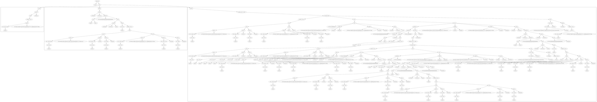

Design
======

*note: this is a draft doc.*

## Overview

Animagus-gui will be a desktop and/or web application to design AST and export(serialize) to protocol buffers. The generated AST can then be loaded by Animagus to run.

Animagus-gui performs the following actions:

1. Create a document which is a canvas to hold and draw an AST tree.
2. Create and modify objects, connect them to construct the tree.
3. Save the document.
4. Export the AST tree, write a binary file encoded with protobuf.

Simply put, it's a drawing tool for manipulating a tree.

## Goals

* Easy to understand and simple to use. Non-developer user should be able to design AST tree.
* It should run on Windows, macOS and Linux as a native desktop application, and ideally in a browser as a web application.
* When running as a desktop application, it should work offline.
* Document could be saved and opened without any information loss.

## Requirements & use cases

*todo*

## Architecture

### Storage

* The application needs to save document to or load document from the local file system. The document could be a simple JSON file but with a custom extension so that it's associated with our app.
* The exported AST definition is serialized to protocol buffer.

### UI

* The main UI consists of 4 parts, similar to a common drawing app:
  1. A left object library panel. It lists all kinds of AST nodes that user can drag on to the canvas.
  2. The eidtor canvas view. It renders an AST editing view.
    - When an AST node is right-clicked, it might need to show a context memu for certain quick actions.
    - When an AST node is selected or editable part of the node is clicked, the property panel (see below) will display its properties, the inline editor will allow direct modifications to some properties.
    - It might become inpractical to draw the whole AST tree. Take this [udt](https://github.com/xxuejie/animagus/tree/master/examples/udt) design for example:
    
    To place and draw this, we need to divide the AST tree to smaller components, such as:
      * The root view. It draws the AST root containing one or more calls. It can collapse these calls that the root view could be rendered as a small high level view.
      * Call view. A call view contains a single node as tree. A call view is a specical node view that can only be referenced by the root view.
      * Node view. A node view can be either a leaf, or a tree. Then it can be referenced from other nodes.
    - Although described above as inpractical, we perhaps can have another readonly canvas (view) to draw the whole AST root tree, with all non-leaf nodes expanding. It could support zooming and scrolling.
  3. A right property inspector panel. When a node is selected, the panel shows properties that can be edited.
  4. A toolbar which has some action buttons for quick use.

### Framework

*tbd* Candidates: (a) SwiftUI (for quick demo MVP), (b) Flutter, (c) HTML/CSS, etc.

## Initial scope

* Create a document/canvas.
* Insert object (AST node) from the object library panel or menu.
* Connect objects (create an edge between them).
* Drag & drop to organize and connect objects.
* Select and edit object (type, description, other basic properties) on the property panel.
  - Ideally to also allow editing these inline.
* Export the canvas to AST binary file as protocol buffer message (AST definition).
* Save and open document.

Further work and nice to have features might consist of:

* Zoom in/out.
* Undo/redo support. Without this the app might be difficult to use if user makes unintended change and wants to revert that.
* Control animagus from UI, feeding it with the generated AST.
* Others?