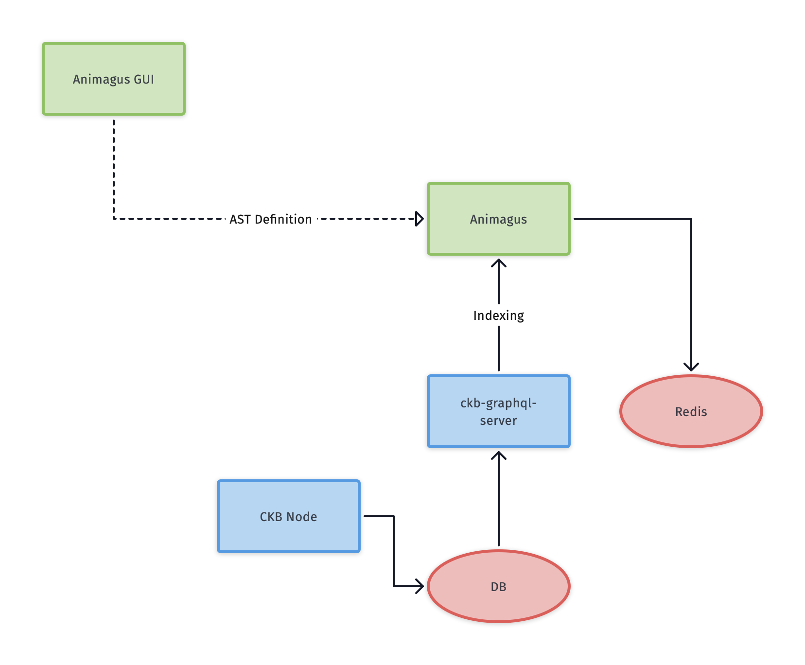

GUI for animagus
--------------

Design and implement a GUI application to help use animagus.

## Users

* Developers who have the ability to write AST of their choice of language, but dont' want to do so.
* Dapps operators (including developers) that are not capable of writing code.

## Features

### Must have (minimum target)

* Create a canvas/project.
* Insert object (AST node) from an object library/list.
* Connect objects (create an edge between them).
* Drag & drop to organize and connect objects.
* Select and edit object (type, description, other basic properties).
* Export the canvas to AST binary file as protocol buffer message (AST definition).

### Nice to have (phase 2?)

* Undo/Redo.
* Save the canvas/project to file.
* Load a canvas/project from file.

## Tech stack considerations

* Cross-platform is a long-term objective. Not required for phase 1 (Initial release by the end of Q2 2020).
* Web first, but the initial release could be a single platform native MVP.
  - Perhaps quick development with SwiftUI, with which I'm personally familiar.
* Framework candidates
  - SwiftUI (for MVP demo version)
  - Flutter (Web and macOS desktop)
* Drawing library
  - HTML Canvas
  - Skia
  - SwiftUI

## Schedule

  * ~ April 24, 2020
    - Collect requirements
    - Experiment and do research
    - Evaluate Flutter, Skia, etc.
  * May 1 ~ June 19
    - Phase 1 development
    - Initial release on June 19
    - Published demo version at the end of June
  * Q3
    - Improvements and phase 2 features
    - Cross-platform: which OS TBD

## References

* [Animagus](https://github.com/xxuejie/animagus)
* [animagus-xi](https://github.com/doitian/animagus-xi)
* [animagus-swift-example](https://github.com/ashchan/animagus-swift-example)